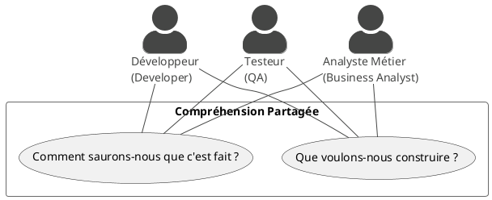

# Chapitre 1 : Les Fondations du BDD - L'essentiel

Bienvenue dans ce premier module dédié au Développement Guidé par le Comportement, ou **BDD (Behavior-Driven
Development)**. Avant de plonger dans le code et la technique, il est crucial de comprendre la philosophie qui se cache
derrière ces trois lettres. Préparez-vous à changer votre perspective sur les tests et la collaboration en équipe !

### Objectifs pédagogiques

À la fin de ce chapitre, vous serez capable de :

* **Définir** ce qu'est le BDD et le problème qu'il résout.
* **Expliquer** le concept des "Trois Amigos" et l'importance de la collaboration.
* **Identifier et décrire** les trois piliers du BDD : le Langage Ubiquitaire, la Spécification par l'Exemple et la
  Documentation Vivante.
* **Lire et comprendre** la syntaxe Gherkin.
* **Rédiger** un premier scénario de test simple en utilisant la syntaxe Gherkin.

### Introduction : La tour de Babel du développement logiciel

Imaginez cette scène, que vous avez peut-être déjà vécue : un expert métier (le "client") décrit une nouvelle
fonctionnalité. Il utilise ses propres termes, son propre jargon. Le développeur écoute, traduit cette demande en
logique de programmation, en classes, en méthodes. Puis, le testeur (QA) arrive, et essaie de comprendre ce qui a été
demandé et ce qui a été codé pour créer ses plans de test.

Le résultat ? Souvent, un "téléphone arabe" où le produit final ne correspond pas exactement au besoin initial. Chacun
parlait une langue différente : celle du métier, celle du code, celle du test.

Le BDD est né de ce constat. Son but premier n'est pas de tester, mais de **faciliter la communication et la
collaboration**. C'est une méthode qui s'assure que tout le monde – le métier, les développeurs, les testeurs – partage
une compréhension commune de ce que le logiciel doit faire. Comment ? En utilisant des exemples concrets, rédigés dans
un langage que tout le monde peut comprendre.

Pour vous, futurs concepteurs développeurs, maîtriser le BDD, c'est vous assurer de construire la **bonne application**,
et pas seulement de construire l'application **correctement**.

### 1. Qu'est-ce que le BDD ?

Le BDD n'est pas sorti de nulle part. C'est une évolution du **TDD (Test-Driven Development)**. En TDD, le cycle est "
Red-Green-Refactor" : on écrit un test qui échoue, on écrit le code pour le faire passer, puis on l'améliore.

Le BDD pousse cette idée plus loin. Au lieu de se concentrer sur des tests unitaires très techniques, il se concentre
sur le **comportement attendu** de l'application du point de vue de l'utilisateur.

La pierre angulaire du BDD est un atelier de collaboration appelé la réunion des **"Trois Amigos"**.



Ces trois rôles (qui peuvent être portés par plusieurs personnes) se réunissent pour discuter d'une fonctionnalité. Le
but est de définir le comportement attendu à l'aide d'exemples concrets. Ces exemples deviendront les spécifications,
qui deviendront ensuite des tests automatisés.

### 2. Les Piliers du BDD

Le BDD repose sur trois concepts fondamentaux qui travaillent en synergie.

<tabs>
<tab title="Langage Ubiquitaire">
Le **Langage Ubiquitaire** (Ubiquitous Language) est un terme issu du Domain-Driven Design (DDD). L'idée est simple : toute l'équipe projet doit utiliser le **même vocabulaire** pour décrire les concepts du domaine métier.

* **Le problème :** Si le métier parle de "Client Premium" et que les développeurs codent une classe `SpecialUser`, il y
  a une dissonance.
* **La solution BDD :** On se met d'accord sur les termes. Si le métier dit "Panier", le code contiendra une classe
  `Basket`, la base de données une table `BASKET`, et les tests manipuleront un `Basket`.

Ce langage partagé est la base de la communication. Il élimine les ambiguïtés et les erreurs de traduction.

</tab>
<tab title="Spécification par l'Exemple">
Les humains comprennent mieux avec des exemples concrets qu'avec des règles abstraites. La Spécification par l'Exemple (Specification by Example) consiste à définir le comportement d'une fonctionnalité en décrivant des scénarios précis.

* **Règle abstraite :** "L'utilisateur doit avoir un mot de passe fort." (Qu'est-ce que "fort" ?)
* **Exemple concret :**
    * **Scénario 1 :** Quand un utilisateur s'inscrit avec le mot de passe "123456", le système doit refuser
      l'inscription et afficher "Le mot de passe est trop faible".
    * **Scénario 2 :** Quand un utilisateur s'inscrit avec le mot de passe "P@ssword!2024", le système doit accepter
      l'inscription.

Ces exemples deviennent les **critères d'acceptation** de la fonctionnalité.

</tab>
<tab title="Documentation Vivante">
C'est peut-être l'aspect le plus puissant du BDD. Les exemples que nous écrivons ne sont pas juste jetés après la discussion. Ils sont transformés en **tests automatisés**.

* La spécification (le texte des exemples) est directement liée au code qui la teste.
* Si un test échoue, cela signifie que le comportement du code ne correspond plus à la spécification.
* Par conséquent, la documentation ne peut jamais être obsolète ! Si elle l'était, les tests seraient rouges.

On l'appelle **"vivante"** car elle évolue en permanence avec le code. C'est une source de vérité unique et fiable pour
tout le monde.

</tab>
</tabs>

### 3. Gherkin : Le Langage pour Décrire le Comportement

Pour écrire ces spécifications sous une forme structurée et automatisable, nous utilisons un langage dédié appelé *
*Gherkin**. Gherkin est lisible par les humains (métier, testeurs) et interprétable par des outils comme Cucumber (que
nous verrons bientôt).

Un fichier Gherkin (avec l'extension `.feature`) décrit une seule fonctionnalité (`Feature`). Cette fonctionnalité est
illustrée par un ou plusieurs scénarios (`Scenario`).

Chaque scénario suit une structure simple : **Given / When / Then**.

```gherkin
# Nom du fichier : retrait_argent.feature

# Feature: Décrit la fonctionnalité globale
Feature: Retrait d'argent au distributeur automatique

  # Scenario: Décrit un exemple de comportement spécifique
  Scenario: Le compte est suffisamment approvisionné
    
    # Given: Met en place le contexte initial. L'état du monde avant l'action.
    Given le solde de mon compte est de 100€
    And la carte est valide
    And le distributeur contient de l'argent

    # When: Décrit l'action, l'événement déclencheur.
    When je retire 20€

    # Then: Décrit le résultat attendu, la conséquence de l'action.
    Then le distributeur doit me donner 20€
    And le nouveau solde de mon compte doit être de 80€
```

<warning>
**Structurez vos pensées avec Given-When-Then !**
<ul>
<li><b>Given (Étant donné que) :</b> Le contexte, l'état initial. C'est la mise en place.</li>
<li><b>When (Quand) :</b> L'action effectuée par l'utilisateur ou le système. Il ne devrait y avoir qu'un seul <code>When</code> par scénario pour garder le focus.</li>
<li><b>Then (Alors) :</b> La vérification, le résultat observable. C'est ici que vous définissez vos attentes.</li>
</ul>
Les mots-clés <code>And</code> (Et) et <code>But</code> (Mais) servent à enchaîner plusieurs lignes du même type pour une meilleure lisibilité.
</warning>

---

### Exercice 1 : Écrire votre premier scénario Gherkin

Il est temps de mettre en pratique ! Pour nos exercices, nous allons travailler sur un projet fil rouge : une **API de
gestion de bibliothèque**.

**Votre mission :**
En tant que futur concepteur développeur, vous participez à un atelier avec les "Trois Amigos" pour la fonctionnalité de
recherche de livres. La user story est la suivante : *"En tant qu'utilisateur, je veux pouvoir rechercher un livre par
son titre pour trouver ses informations."*

Rédigez un fichier Gherkin nommé `recherche_livre.feature` qui contient deux scénarios basés sur cette histoire :

1. Un scénario où l'utilisateur cherche un livre qui existe dans la bibliothèque.
2. Un scénario où l'utilisateur cherche un livre qui n'existe pas.

Prenez quelques minutes pour y réfléchir avant de regarder la correction. Pensez à la structure `Given / When / Then`.
Quel est l'état initial ? Quelle est l'action ? Quel est le résultat attendu dans chaque cas ?

### Correction exercice 1 {collapsible='true'}

Voici une solution possible. Il n'y a pas une seule bonne réponse, mais la structure et l'intention doivent être
similaires.

```gherkin
# Nom du fichier : recherche_livre.feature

Feature: Recherche de livres dans le catalogue
  En tant qu'utilisateur de la bibliothèque,
  Je veux pouvoir rechercher des livres par leur titre
  Afin de vérifier leur disponibilité et leurs détails.

  # Le Background permet de définir un contexte (Given)
  # commun à tous les scénarios de ce fichier.
  # C'est très pratique pour ne pas se répéter !
  Background:
    Given les livres suivants existent dans la bibliothèque:
      | titre              | auteur           |
      | L'Étranger         | Albert Camus     |
      | Dune               | Frank Herbert    |
      | 1984               | George Orwell    |

  Scenario: Recherche d'un livre existant par son titre
    When je recherche le livre avec le titre "Dune"
    Then les informations du livre suivant doivent être retournées:
      | titre              | auteur           |
      | Dune               | Frank Herbert    |

  Scenario: Recherche d'un livre inexistant par son titre
    When je recherche le livre avec le titre "Le Seigneur des Anneaux"
    Then aucun livre ne doit être trouvé
    And un message d'erreur "Livre non trouvé" doit être affiché

```

**Pourquoi cette solution est-elle bonne ?**

* Elle utilise un `Feature` pour donner le contexte global et la valeur métier.
* Elle utilise un `Background` pour initialiser l'état de la bibliothèque, ce qui évite de répéter ce `Given` dans
  chaque scénario.
* Les scénarios ont des noms clairs et décrivent un seul comportement à la fois.
* Le `When` décrit clairement l'action de l'utilisateur.
* Le `Then` décrit le résultat observable, ce que le système doit produire.
* L'utilisation de tableaux (`Data Tables`) rend la définition des données très lisible, même pour un non-technicien.
  Nous apprendrons à les manipuler en Java plus tard.

---

### Auto-évaluation

Testez vos connaissances ! (Les corrections se trouvent à la fin de l'ensemble du support de cours).

1. **Quel est l'objectif principal du BDD ?**
   a) Remplacer tous les tests unitaires.
   b) Écrire des tests plus rapidement.
   c) Faciliter la collaboration et la communication au sein de l'équipe projet.
   d) Générer automatiquement de la documentation.

2. **Qui sont les "Trois Amigos" ?**
   a) Le Chef de Projet, l'Architecte, le Scrum Master.
   b) Le Product Owner (Métier), le Développeur, le Testeur (QA).
   c) Trois développeurs seniors.
   d) L'Utilisateur final, le Développeur, le Designer UX.

3. **Dans un scénario Gherkin, quel mot-clé est utilisé pour décrire l'action principale de l'utilisateur ?**
   a) `Given`
   b) `When`
   c) `Then`
   d) `Scenario`

4. **En vos propres mots, qu'est-ce que la "Documentation Vivante" et pourquoi est-ce un concept puissant ?**

5. **Pourquoi le "Langage Ubiquitaire" est-il considéré comme un pilier du BDD ? Donnez un exemple de problème qu'il
   permet d'éviter.**

---

### Conclusion de cette première partie

Félicitations ! Vous venez de découvrir les fondations conceptuelles du BDD. Vous savez maintenant que le BDD est avant
tout une **pratique de collaboration** qui vise à construire un consensus autour de ce qu'un logiciel doit faire. Vous
avez appris que cette collaboration s'exprime à travers un **langage partagé** et des **exemples concrets**, formalisés
avec **Gherkin**.

Ces spécifications ne sont pas de simples textes : elles sont destinées à devenir une **documentation vivante et
automatisée**, garantissant que le logiciel respecte toujours le besoin métier.

Maintenant que vous maîtrisez la théorie, il est temps de mettre les mains dans le code ! Dans le prochain chapitre,
nous allons configurer notre projet Spring Boot, y intégrer les outils nécessaires au BDD, et transformer notre scénario
Gherkin en un véritable test automatisé. L'aventure ne fait que commencer 