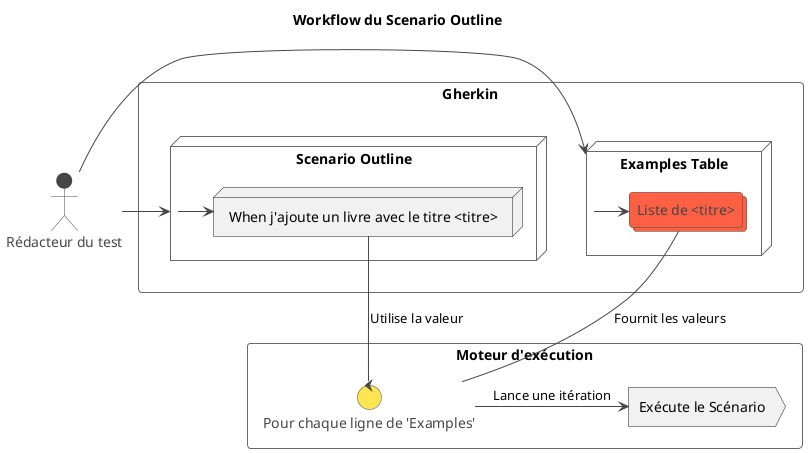

# Chapitre 1 : Les Fondations du BDD - Pour aller plus loin

Vous maîtrisez maintenant la structure de base `Given/When/Then`. C'est excellent ! Mais que se passe-t-il lorsque vos
fonctionnalités deviennent plus complexes ? Quand vous devez tester des dizaines de variations d'un même comportement ?
Si vous écriviez un scénario pour chaque cas, vos fichiers `.feature` deviendraient rapidement longs, répétitifs et
difficiles à maintenir.

C'est là que les fonctionnalités avancées de Gherkin entrent en jeu. Elles sont conçues pour vous aider à rester **DRY (
Don't Repeat Yourself)** et à structurer vos tests de manière logique et lisible.

### Objectifs pédagogiques

À la fin de cette section, vous serez capable de :

* **Factoriser** les conditions initiales communes avec le mot-clé `Background`.
* **Écrire des scénarios paramétrés** pour tester de multiples jeux de données avec `Scenario Outline` et `Examples`.
* **Utiliser** les `Data Tables` pour passer des données structurées à vos tests.
* **Distinguer** le style d'écriture "Déclaratif" du style "Impératif" et comprendre pourquoi le premier est préférable.
* **Rédiger** des scénarios BDD robustes, maintenables et expressifs.

### Introduction : De l'artisanat à l'industrialisation

Imaginez que vous êtes un artisan qui vient de fabriquer un magnifique prototype de chaise. C'est notre premier
scénario. Maintenant, le client en commande 500. Allez-vous refabriquer chaque chaise de A à Z ? Bien sûr que non. Vous
allez créer des gabarits, des moules, optimiser votre processus.

C'est exactement la même idée ici. Les techniques que nous allons voir sont les gabarits et les outils qui vont vous
permettre de "produire" des tests de haute qualité en série, de manière efficace et cohérente. Vous passerez du
développeur qui écrit des tests à l'architecte qui conçoit une stratégie de test complète et durable.

### 1. Factoriser le contexte avec `Background`

Très souvent, plusieurs scénarios au sein d'un même fichier `.feature` partagent les mêmes prérequis. Dans notre exemple
de recherche de livre, chaque scénario commençait par supposer qu'une certaine liste de livres existait.

<procedure title="Le problème : la répétition">
<p>Sans <code>Background</code>, nous devrions répéter le même <code>Given</code> partout :</p>

```gherkin
Feature: Recherche de livres

  Scenario: Un livre existant
    Given les livres suivants existent dans la bibliothèque:
      | titre              | auteur           |
      | Dune               | Frank Herbert    |
      | 1984               | George Orwell    |
    When je recherche le livre avec le titre "Dune"
    Then ...

  Scenario: Un livre inexistant
    Given les livres suivants existent dans la bibliothèque:
      | titre              | auteur           |
      | Dune               | Frank Herbert    |
      | 1984               | George Orwell    |
    When je recherche le livre avec le titre "Inexistant"
    Then ...
```

</procedure>

Le mot-clé `Background` est la solution. Il vous permet de définir un ensemble de `Given` qui sera exécuté **avant
chaque scénario** du fichier.

<procedure title="La solution : le `Background`">
<p>On factorise le contexte commun une seule fois.</p>

```gherkin
Feature: Recherche de livres

  Background:
    Given les livres suivants existent dans la bibliothèque:
      | titre              | auteur           |
      | Dune               | Frank Herbert    |
      | 1984               | George Orwell    |

  Scenario: Un livre existant
    When je recherche le livre avec le titre "Dune"
    Then les informations du livre "Dune" sont affichées.

  Scenario: Un livre inexistant
    When je recherche le livre avec le titre "Inexistant"
    Then un message d'erreur "Livre non trouvé" est affiché.
```

</procedure>

<warning>
**Bonne pratique :** Un <code>Background</code> ne doit contenir que des étapes <code>Given</code>. Il sert à mettre en place le contexte, pas à décrire une action (<code>When</code>) ou une vérification (<code>Then</code>). Il doit être court et décrire l'état "normal" du système avant que le scénario ne commence.
</warning>

### 2. Tester de multiples données avec `Scenario Outline`

Imaginons que nous développions la fonctionnalité d'ajout d'un livre. Il existe des règles de validation : le titre ne
doit pas être vide, l'auteur non plus, etc. Nous devons tester tous ces cas.

Devrions-nous écrire un scénario pour le cas "titre vide", un autre pour "auteur vide", un autre pour le "cas nominal" ?
Non, ce serait très répétitif. C'est là que le `Scenario Outline` (Modèle de Scénario) brille.

Il permet de définir un scénario "gabarit" avec des variables (notées `<variable>`), puis de fournir les différentes
valeurs à tester dans un tableau `Examples`.


<!--

-->
**Exemple concret :**

```gherkin
Feature: Ajout d'un nouveau livre au catalogue

  Background:
    Given je suis authentifié en tant que bibliothécaire

  Scenario Outline: Validation des données lors de l'ajout d'un livre
    When j'essaie d'ajouter un livre avec le titre "<titre>" et l'auteur "<auteur>"
    Then le système doit retourner le statut "<statut>"
    And si le statut est "ERREUR", le message doit contenir "<message>"

    Examples:
      | titre                   | auteur          | statut    | message                          |
      | Le Rouge et le Noir     | Stendhal        | SUCCES    | Livre ajouté avec succès         |
      |                         | Victor Hugo     | ERREUR    | Le titre ne peut pas être vide   |
      | Les Misérables          |                 | ERREUR    | L'auteur ne peut pas être vide   |
      | A                       | B               | ERREUR    | Le titre doit faire 2 chars min  |
```

Cucumber exécutera ce scénario 4 fois, en remplaçant à chaque fois les variables `<titre>`, `<auteur>`, etc., par les
valeurs de chaque ligne du tableau `Examples`. C'est extrêmement puissant pour les tests de validation.

### 3. Structurer les données avec les `Data Tables`

Nous les avons déjà intuitivement utilisées dans le `Background`. Les `Data Tables` sont un moyen de passer des données
structurées (plus qu'une simple chaîne ou un nombre) à une étape de test.

Elles sont parfaites pour :

* Initialiser une liste d'entités dans un `Given`.
* Décrire le contenu d'un formulaire envoyé dans un `When`.
* Vérifier une liste de résultats dans un `Then`.

**Exemple : Vérifier le contenu d'un panier**

```gherkin
  Scenario: Vérification du contenu du panier après ajout
    Given mon panier est vide
    When j'ajoute les livres suivants à mon panier:
      | titre  | auteur        |
      | Dune   | Frank Herbert |
      | 1984   | George Orwell |
    Then mon panier doit contenir 2 livres
    And le contenu du panier doit être:
      | titre  | auteur        |
      | 1984   | George Orwell |
      | Dune   | Frank Herbert |
```

Plus tard, dans le code Java, nous verrons comment Cucumber transforme magiquement ces tableaux en
`List<Map<String, String>>` ou même directement en une liste de vos objets (DTOs), rendant leur manipulation très
facile.

### 4. Style Déclaratif vs. Impératif : Pensez "Quoi", pas "Comment"

C'est l'un des concepts les plus importants pour écrire des scénarios BDD de qualité.

<tabs>
<tab title="Style Impératif (À éviter)">
Le style impératif décrit les **actions techniques**, les "clics". Il est très lié à l'implémentation de l'interface.

```gherkin
  Scenario: Recherche impérative
    When je saisis "Dune" dans le champ avec l'ID "search_box"
    And je clique sur le bouton avec le libellé "Rechercher"
    Then je dois voir "Dune" dans l'élément avec la classe "results_list"
```

**Problèmes :**

* Illisible pour un non-technicien.
* Fragile : si un développeur renomme l'ID `search_box` en `book_title_search`, le test est cassé, alors que la
  fonctionnalité, elle, marche toujours.

</tab>
<tab title="Style Déclaratif (À privilégier)">
Le style déclaratif décrit l'**intention de l'utilisateur**, le "quoi".

```gherkin
  Scenario: Recherche déclarative
    When je recherche le livre "Dune"
    Then le livre "Dune" doit apparaître dans les résultats
```

**Avantages :**

* **Lisible par tous :** Un expert métier comprend immédiatement le but du test.
* **Robuste :** Peu importe comment la recherche est implémentée (un champ, un bouton, une recherche vocale...), le test
  reste valide tant que l'intention ("rechercher un livre") est satisfaite.
* **Réutilisable :** L'étape "je recherche le livre..." peut être réutilisée dans de nombreux scénarios.

</tab>
</tabs>

<warning>
**Votre mantra doit être : "Parlez métier, pas technique !".** Vos fichiers <code>.feature</code> doivent décrire le comportement de l'application, pas son implémentation. L'implémentation technique sera cachée dans le code Java qui interprète ces phrases.
</warning>

---

### Exercice 2 : Mettre en pratique les techniques avancées

Maintenant, à vous de jouer ! Pour notre API de gestion de bibliothèque, nous allons définir les scénarios pour la mise
à jour d'un livre existant.

**Votre mission :**
Rédigez un fichier Gherkin nommé `mise_a_jour_livre.feature`. Ce fichier doit :

1. Utiliser un `Background` pour s'assurer qu'un livre spécifique ("Dune" de Frank Herbert, avec l'ID `dune-1965`)
   existe déjà dans le système.
2. Utiliser un `Scenario Outline` pour tester la mise à jour de ce livre avec différents cas.
3. Le scénario doit permettre de tester la mise à jour du titre et de l'année de publication.
4. Prévoyez les cas suivants dans le tableau `Examples`:
    * Mise à jour réussie avec un nouveau titre et une nouvelle année.
    * Mise à jour échouée car le nouveau titre est vide.
    * Mise à jour échouée car la nouvelle année de publication est dans le futur.

Essayez de rédiger le scénario dans un style déclaratif.

### Correction exercice 2 {collapsible='true'}

Voici une proposition qui combine toutes les notions que nous venons de voir.

```gherkin
# Nom du fichier : mise_a_jour_livre.feature

Feature: Mise à jour des informations d'un livre
  En tant que bibliothécaire,
  Je veux pouvoir modifier les informations d'un livre existant
  Afin de corriger les erreurs ou mettre à jour ses données.

  Background:
    Given le livre suivant existe dans la bibliothèque avec l'ID "dune-1965":
      | titre              | auteur           | annee_publication |
      | Dune               | Frank Herbert    | 1965              |

  Scenario Outline: Mise à jour des détails d'un livre existant
    When j'essaie de mettre à jour le livre "dune-1965" avec les informations suivantes:
      | champ               | valeur                 |
      | titre               | <nouveau_titre>        |
      | annee_publication   | <nouvelle_annee>       |
    Then le statut de l'opération doit être "<statut>"
    And le message de réponse doit être "<message>"

    Examples:
      | nouveau_titre         | nouvelle_annee | statut | message                               |
      | Dune Messiah          | 1969           | SUCCES | Livre mis à jour avec succès          |
      |                       | 1969           | ERREUR | Le titre ne peut pas être vide        |
      | Dune                  | 2077           | ERREUR | L'année ne peut pas être future       |

```

**Analyse de cette correction :**

* Le `Background` met en place l'état initial de manière claire et isolée.
* Le `Scenario Outline` définit un modèle de test clair et réutilisable.
* Le tableau `Examples` permet de vérifier 3 cas métier distincts (succès, validation titre, validation année) de
  manière très concise.
* L'utilisation d'un `Data Table` dans le `When` est une façon élégante de représenter les données du formulaire de mise
  à jour.
* Le style est déclaratif : on dit "je mets à jour le livre", pas "je remplis le champ titre" ou "je clique sur
  enregistrer".

---

### Auto-évaluation

1. **Quand est-il judicieux d'utiliser un `Background` ?**
   a) Pour décrire le résultat d'un test.
   b) Quand plusieurs scénarios dans le même fichier partagent les mêmes étapes `Given`.
   c) Pour lister les différents exemples de données à tester.
   d) Pour remplacer un `Scenario`.

2. **Quel est le principal avantage d'un `Scenario Outline` ?**
   a) Il permet d'exécuter les tests plus rapidement.
   b) Il permet d'écrire des scénarios plus longs et détaillés.
   c) Il évite la duplication de la logique de scénario pour tester différents jeux de données.
   d) Il est obligatoire pour tous les fichiers `.feature`.

3. **Lequel de ces "steps" est écrit dans un style déclaratif ?**
   a) `When je clique sur le bouton "#submit-form"`
   b) `When je soumets le formulaire d'inscription`
   c) `When j'appelle la méthode saveUser() du UserService`
   d) `When la requête POST est envoyée à /users`

4. **Expliquez avec vos mots la différence fondamentale entre `Background` et le premier `Given` d'un `Scenario`.**

5. **Donnez un exemple de situation où un `Data Table` serait plus approprié pour passer des données qu'une simple
   variable dans un `Scenario Outline`.**

---

### Conclusion : Vous êtes prêt à structurer vos tests

Félicitations ! Vous avez ajouté à votre arsenal des outils Gherkin puissants qui vont vous permettre de garder vos
spécifications propres, lisibles et maintenables, même sur de grands projets.

Vous savez maintenant comment :

* **Factoriser** le contexte avec `Background` pour ne pas vous répéter.
* **Multiplier** les cas de test sans effort avec `Scenario Outline`.
* **Gérer** des données complexes avec les `Data Tables`.
* **Penser "métier"** grâce au style déclaratif.

La théorie est maintenant solidement acquise. Vous savez **pourquoi** faire du BDD et **comment** écrire des
spécifications de qualité. Il est grand temps de faire le lien avec notre application Spring Boot.

Dans le prochain module, nous allons enfin configurer notre environnement de développement, ajouter les dépendances
Cucumber à notre projet et préparer le terrain pour transformer notre premier fichier `.feature` en un véritable test
automatisé qui s'exécute. Préparez votre IDE, l'action commence maintenant 