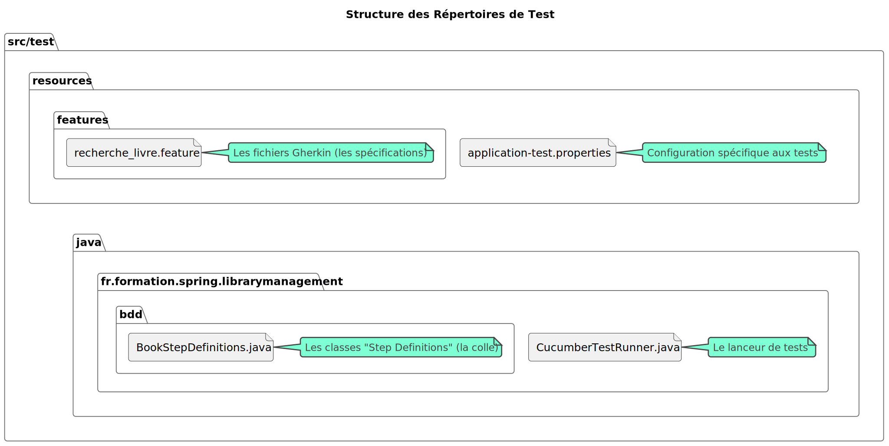
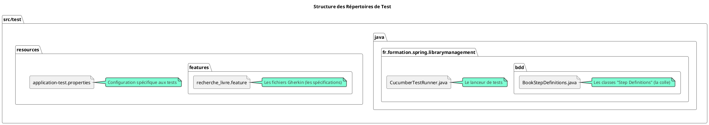

# Chapitre 2 : Mise en Place de l'Environnement de Développement 

Bienvenue dans le "garage" ! Nous avons les plans de la voiture (nos connaissances en BDD et Gherkin), il est maintenant
temps de rassembler les outils et de monter le châssis. Ce chapitre est fondamental. Une bonne configuration de projet
est la garantie d'un développement fluide et sans frustration.

Nous allons créer un projet Spring Boot de A à Z, y intégrer Cucumber, et structurer notre code pour qu'il soit prêt à
accueillir nos futurs tests.

### Objectifs pédagogiques

À la fin de ce chapitre, vous serez capable de :

* **Générer** un projet Spring Boot avec les dépendances initiales via `start.spring.io`.
* **Ajouter et configurer** les dépendances Maven nécessaires pour Cucumber et son intégration avec Spring et JUnit 5.
* **Comprendre** le rôle de chaque dépendance BDD.
* **Organiser** votre projet en respectant les conventions (fichiers `.feature`, classes de Steps).
* **Créer** la classe "lanceur de tests" (Test Runner) qui permet à JUnit d'exécuter les scénarios Cucumber.
* **Lancer** un premier test et interpréter le résultat "undefined", qui confirme que l'outillage est fonctionnel.

### Introduction : Bâtir sur des fondations solides

Imaginez que vous construisiez une maison. Passeriez-vous directement à la peinture des murs sans avoir posé les
fondations et monté la charpente ? Probablement pas. En développement logiciel, c'est la même chose. Le `pom.xml` (notre
fichier de dépendances), la structure des répertoires et la classe de configuration des tests sont les fondations de
notre projet BDD.

Prendre le temps de bien faire cette étape maintenant vous fera gagner des heures de débogage plus tard. Nous allons
construire une base saine et standard, sur laquelle il sera agréable et efficace de travailler. Alors, retroussez vos
manches, ouvrez votre IDE, c'est parti !

### 1. Création du projet Spring Boot "Bibliothèque"

Notre projet fil rouge est une API de gestion de bibliothèque. Nous allons le créer avec l'outil standard de l'
écosystème Spring : `start.spring.io`.

<procedure title="Générer le projet initial">

1. Rendez-vous sur [https://start.spring.io](https://start.spring.io).
2. Configurez le projet comme suit :
    * **Project :** Maven
    * **Language :** Java
    * **Spring Boot :** 3.2.x ou plus récent
    * **Project Metadata :**
        * **Group :** `fr.formation.spring`
        * **Artifact :** `library-management`
        * **Name :** library-management
        * **Package name :** `fr.formation.spring.librarymanagement`
        * **Packaging :** Jar
        * **Java :** 17 (ou plus récent)
    * **Dependencies :** Cliquez sur "ADD DEPENDENCIES" et ajoutez :
        * `Spring Web` (pour créer des API REST)
        * `Spring Data JPA` (pour la persistance des données)
        * `H2 Database` (une base de données en mémoire, parfaite pour les tests)
        * `Lombok` (pour réduire le code "boilerplate" dans nos entités)
3. Cliquez sur "GENERATE". Un fichier `.zip` est téléchargé.
4. Décompressez-le et ouvrez le projet dans votre IDE préféré (IntelliJ IDEA, Eclipse, VS Code...).

</procedure>

Vous avez maintenant un projet Spring Boot standard, prêt à être personnalisé pour le BDD.

### 2. Ajout des dépendances Cucumber

Le cœur de notre configuration réside dans le fichier `pom.xml`. Nous devons y ajouter les "briques" logicielles qui
permettent à Cucumber de fonctionner et de dialoguer avec Spring.

Ouvrez votre `pom.xml` et ajoutez les dépendances suivantes à l'intérieur de la balise `<dependencies>`.

```xml
<!-- Dépendances pour Cucumber BDD -->
<dependency>
    <groupId>io.cucumber</groupId>
    <artifactId>cucumber-java</artifactId>
    <version>7.15.0</version>
    <scope>test</scope>
</dependency>

<dependency>
<groupId>io.cucumber</groupId>
<artifactId>cucumber-spring</artifactId>
<version>7.15.0</version>
<scope>test</scope>
</dependency>

<dependency>
<groupId>io.cucumber</groupId>
<artifactId>cucumber-junit-platform-engine</artifactId>
<version>7.15.0</version>
<scope>test</scope>
</dependency>
```

<warning>
**À quoi servent ces dépendances ?**
<ul>
<li><code>cucumber-java</code> : C'est le moteur principal de Cucumber pour Java. Il sait lire les fichiers <code>.feature</code> et chercher le code Java correspondant.</li>
<li><code>cucumber-spring</code> : C'est la colle magique ! Elle permet à Cucumber de comprendre le contexte Spring. Grâce à elle, nous pourrons utiliser des annotations comme <code>@Autowired</code>, <code>@SpringBootTest</code>, ou <code>@MockBean</code> directement dans nos classes de test BDD.</li>
<li><code>cucumber-junit-platform-engine</code> : C'est l'adaptateur qui permet à JUnit 5 (le framework de test par défaut de Spring Boot) de découvrir et d'exécuter les scénarios Cucumber comme s'il s'agissait de tests JUnit classiques.</li>
</ul>
N'oubliez pas d'utiliser le <code>&lt;scope&gt;test&lt;/scope&gt;</code>, car ces dépendances ne sont utiles que pour la phase de test, pas pour le code de production de votre application.
</warning>

Après avoir ajouté ces dépendances, demandez à Maven de recharger le projet (dans IntelliJ, un petit 'M' apparaît en
haut à droite de l'éditeur `pom.xml`).

### 3. Structure du projet pour le BDD

Une bonne organisation est la clé. Voici la structure de répertoires que nous allons adopter. Elle est standard et
facile à comprendre.



<!--

-->
**En résumé :**

* **`src/test/resources/features`** : C'est ici que vous placerez tous vos fichiers `.feature`. Le fait de les mettre
  dans `resources` les rend accessibles au "classpath" de test.
* **`src/test/java/fr/formation/spring/librarymanagement/bdd`** : C'est ici que vous créerez les classes Java qui
  implémentent les étapes Gherkin (les "Step Definitions"). Les organiser dans un sous-package `bdd` est une bonne
  pratique.

### 4. Création du Lanceur de Tests (Test Runner)

Comment JUnit sait-il qu'il doit aller chercher des fichiers `.feature` et les exécuter avec Cucumber ? Nous devons lui
indiquer explicitement avec une classe de configuration.

Créez une classe nommée `CucumberTestRunner` à la racine de vos sources de test (
`src/test/java/fr/formation/spring/librarymanagement`).

```java
package fr.formation.spring.librarymanagement;

import io.cucumber.junit.platform.engine.Cucumber;

/*
 * Cette classe est le point d'entrée pour que JUnit 5
 * découvre et exécute les scénarios Cucumber.
 * L'annotation @Cucumber fait tout le travail.
 * Aucune méthode n'est nécessaire dans le corps de la classe.
 */
@Cucumber
public class CucumberTestRunner {
}
```

Cette simple classe annotée avec `@Cucumber` suffit pour l'intégration la plus basique. Par défaut, Cucumber va scanner
l'ensemble du `classpath` à la recherche de fichiers `.feature` et des classes de "glue" (les Step Definitions).

### 5. Préparation du projet fil rouge

Pour nos exercices, nous avons besoin de nos entités et de données de test.

<procedure title="Mise en place des entités et des données">
<p>Ajoutez les classes suivantes dans votre package de production <code>fr.formation.spring.librarymanagement.domain</code>.</p>

<tabs>
<tab title="Book.java">

```java
package fr.formation.spring.librarymanagement.domain;

import jakarta.persistence.Entity;
import jakarta.persistence.Id;
import lombok.Data;
import lombok.NoArgsConstructor;

// Entité représentant un livre
@Entity
@Data // Génère getters, setters, toString, etc. avec Lombok
@NoArgsConstructor // Génère un constructeur sans arguments pour JPA
public class Book {

    @Id
    private String isbn; // International Standard Book Number

    private String title;
    private String author;
    private String publisher;
    private int publicationYear;
}
```

</tab>
<tab title="BookRepository.java">
<p>Créez cette interface dans le package <code>fr.formation.spring.librarymanagement.repository</code>.</p>

```java
package fr.formation.spring.librarymanagement.repository;

import fr.formation.spring.librarymanagement.domain.Book;
import org.springframework.data.jpa.repository.JpaRepository;

// Interface pour l'accès aux données des livres
public interface BookRepository extends JpaRepository<Book, String> {
}
```

</tab>
<tab title="DataInitializer.java (pour les données de test)">
<p>Créez cette classe dans un package <code>fr.formation.spring.librarymanagement.config</code>. Elle permettra d'avoir des données au démarrage de l'application.</p>

```java
package fr.formation.spring.librarymanagement.config;

import fr.formation.spring.librarymanagement.domain.Book;
import fr.formation.spring.librarymanagement.repository.BookRepository;
import org.springframework.boot.ApplicationArguments;
import org.springframework.boot.ApplicationRunner;
import org.springframework.stereotype.Component;

// Ce composant s'exécute au démarrage de l'application
// pour initialiser la base de données avec des données de test.
@Component
public class DataInitializer implements ApplicationRunner {

    private final BookRepository bookRepository;

    public DataInitializer(BookRepository bookRepository) {
        this.bookRepository = bookRepository;
    }

    @Override
    public void run(ApplicationArguments args) throws Exception {
        // Crée et sauvegarde le premier livre
        Book dune = new Book();
        dune.setIsbn("978-0441013593");
        dune.setTitle("Dune");
        dune.setAuthor("Frank Herbert");
        dune.setPublisher("Chilton Books");
        dune.setPublicationYear(1965);
        bookRepository.save(dune);

        // Crée et sauvegarde le deuxième livre
        Book foundation = new Book();
        foundation.setIsbn("978-0553803719");
        foundation.setTitle("Foundation");
        foundation.setAuthor("Isaac Asimov");
        foundation.setPublisher("Gnome Press");
        foundation.setPublicationYear(1951);
        bookRepository.save(foundation);
    }
}
```

</tab>
</tabs>
</procedure>

Notre projet est maintenant prêt et contient même des données !

---

### Exercice 3 : Lancer le premier test (qui échouera)

Notre objectif est simple : vérifier que toute la tuyauterie est correctement branchée. Nous allons créer un fichier
`.feature` et sa classe de Step Definitions (vide pour l'instant), puis lancer le test.

**Votre mission :**

1. Créez le fichier `book_search.feature` dans `src/test/resources/features/`.
2. Créez la classe `BookStepDefinitions` dans `src/test/java/fr/formation/spring/librarymanagement/bdd/`.
3. Lancez les tests via votre IDE (généralement en faisant un clic droit sur la classe `CucumberTestRunner` et en
   choisissant "Run").
4. Observez la console.

**Fichier `book_search.feature` :**

```gherkin
Feature: Recherche de livre par ISBN
  En tant qu'utilisateur, je veux rechercher un livre par son ISBN
  pour obtenir ses détails complets.
  
  Scenario: Recherche d'un livre existant
    Given un livre existe avec l'ISBN "978-0441013593"
    When l'utilisateur recherche le livre par cet ISBN
    Then les détails du livre "Dune" sont retournés
```

**Classe `BookStepDefinitions.java` (initialement vide) :**

```java
package fr.formation.spring.librarymanagement.bdd;

// La classe est vide pour le moment.
// Nous allons la remplir dans le prochain module.
public class BookStepDefinitions {
}
```

Qu'attendez-vous comme résultat ? Réfléchissez-y avant de lancer.

### Correction exercice 3 {collapsible='true'}

Si vous avez tout configuré correctement, en lançant `CucumberTestRunner`, vous ne devriez voir ni une réussite verte,
ni une erreur rouge classique. À la place, la console de votre IDE affichera une sortie similaire à celle-ci :

```
1 scenario (1 undefined)
3 steps (3 undefined)
0m0.123s

You can implement missing steps with the snippets below:

@Given("un livre existe avec l'ISBN {string}")
public void un_livre_existe_avec_l_isbn(String string) {
    // Write code here that turns the phrase above into concrete actions
    throw new io.cucumber.java.PendingException();
}

@When("l'utilisateur recherche le livre par cet ISBN")
public void l_utilisateur_recherche_le_livre_par_cet_isbn() {
    // Write code here that turns the phrase above into concrete actions
    throw new io.cucumber.java.PendingException();
}

@Then("les détails du livre {string} sont retournés")
public void les_details_du_livre_sont_retournes(String string) {
    // Write code here that turns the phrase above into concrete actions
    throw new io.cucumber.java.PendingException();
}
```

**Analyse du résultat :**

C'est un **succès** ! Ce résultat "undefined" (non défini) est exactement ce que nous voulions. Il prouve que :

1. JUnit a bien trouvé et lancé notre `CucumberTestRunner`.
2. Cucumber a lu et compris notre fichier `book_search.feature`.
3. Il a analysé les 3 étapes (`Given`, `When`, `Then`).
4. Il n'a trouvé **aucune méthode Java** correspondant à ces phrases.
5. Pour nous aider, il a **généré les "snippets"** (bouts de code) exacts que nous devons copier/coller dans notre
   classe `BookStepDefinitions` pour commencer à implémenter la logique de test.

Notre "laboratoire BDD" est officiellement opérationnel !

---

### Auto-évaluation

1. **Dans quel répertoire est-il recommandé de placer les fichiers `.feature` ?**
   a) `src/main/java`
   b) `src/test/java`
   c) `src/main/resources`
   d) `src/test/resources`

2. **Quelle dépendance Maven est cruciale pour permettre à Cucumber d'utiliser le contexte de Spring (
   comme `@Autowired`) ?**
   a) `cucumber-java`
   b) `cucumber-spring`
   c) `cucumber-junit-platform-engine`
   d) `spring-boot-starter-test`

3. **Quel est le rôle de la classe `CucumberTestRunner` annotée avec `@Cucumber` ?**
   a) Elle contient la logique de test pour chaque étape Gherkin.
   b) Elle charge les données de test en base.
   c) C'est le point d'entrée qui permet à JUnit 5 de trouver et d'exécuter les tests Cucumber.
   d) Elle définit les entités JPA du projet.

4. **Expliquez en vos propres mots pourquoi obtenir un résultat "undefined" avec des snippets de code est une étape
   positive dans le processus BDD.**

5. **Si vous oubliez la dépendance `cucumber-junit-platform-engine`, que se passera-t-il probablement lorsque vous
   essaierez de lancer vos tests depuis votre IDE ?**

---

### Conclusion de ce deuxième chapitre

Excellent travail ! Vous avez assemblé toutes les pièces du puzzle. Vous êtes parti d'une page blanche pour arriver à un
projet Spring Boot entièrement configuré pour le Développement Guidé par le Comportement.

Vous savez maintenant comment structurer un projet BDD, quelles dépendances sont nécessaires et comment les faire
fonctionner ensemble. Plus important encore, vous avez exécuté votre premier test et compris que la sortie "undefined"
de Cucumber n'est pas une erreur, mais une invitation à coder, un guide pour les prochaines étapes.

Vous avez les fondations, la charpente, et même un plan de travail généré automatiquement. Dans le prochain module, nous
allons enfin passer à l'action : nous allons prendre ces snippets, les intégrer dans notre code, et écrire notre premier
scénario de test BDD complet, de bout en bout, en suivant le fameux cycle "Red-Green-Refactor". L'aventure ne fait que
commencer 