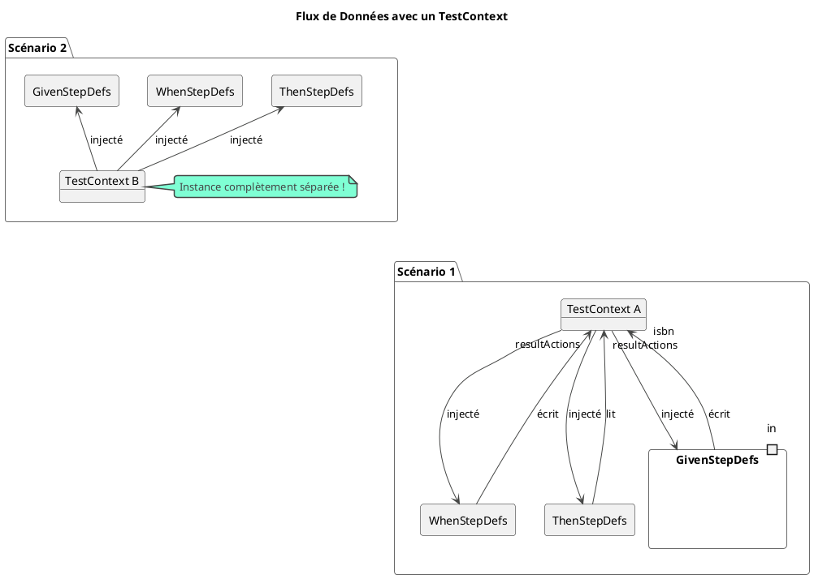

# Chapitre 4 : Techniques Avancées et Gestion de l'État

Félicitations pour avoir franchi l'étape du premier scénario complet ! Vous savez maintenant comment transformer une
spécification en un test fonctionnel. Cependant, vous allez vite vous heurter à deux problèmes courants : la répétition
du code de test pour des cas similaires, et la difficulté de partager des informations entre les étapes d'un scénario (
`Given`, `When`, `Then`).

Ce chapitre vous donnera les solutions pour écrire des tests BDD scalables, propres et professionnels.

### Objectifs pédagogiques

À la fin de ce chapitre, vous serez capable de :

* **Fusionner** des scénarios similaires en un seul modèle grâce à `Scenario Outline` et `Examples`.
* **Passer des objets de données complexes** depuis Gherkin vers Java en utilisant les `Data Tables`.
* **Comprendre** le problème du partage d'état entre les étapes de test.
* **Mettre en place** un "contexte de test" pour partager des données de manière propre et sécurisée tout au long d'un
  scénario.
* **Refactorer** vos classes de "Step Definitions" pour les rendre plus modulaires et maintenables.

### Introduction : De l'unité à la chaîne de montage

Jusqu'à présent, nous avons fonctionné comme un artisan : nous avons construit un scénario de test unique, sur mesure.
C'est parfait pour commencer. Mais que se passe-t-il lorsque vous devez tester 10 cas de validation pour un formulaire ?
Allez-vous construire 10 scénarios quasi identiques à la main ? Certainement pas.

Vous devez passer à un mode "chaîne de montage". Vous avez besoin de gabarits (`Scenario Outline`), de conteneurs pour
vos pièces (`Data Tables`), et d'un chariot pour transporter l'objet en cours de construction d'un poste de travail à l'
autre (`Test Context`). C'est exactement ce que nous allons construire ici. Ces techniques sont le secret pour passer
de "je sais faire du BDD" à "je construis des suites de tests BDD professionnelles".

### 1. Paramétrisation avec `Scenario Outline` et `Data Tables`

Nous avons déjà abordé ces concepts en théorie. Voyons maintenant comment les utiliser en pratique dans notre code
Spring.

Imaginons que nous voulions tester la création d'un livre. Il y a des cas valides et des cas invalides. Le
`Scenario Outline` est parfait pour ça.

**Fichier `src/test/resources/features/book_creation.feature`**

```gherkin
Feature: Création d'un nouveau livre dans le catalogue

  Scenario Outline: Validation des données à la création d'un livre
    When je tente de créer un livre avec les données suivantes
      | champ             | valeur                 |
      | isbn              | <isbn>                 |
      | title             | <title>                |
      | author            | <author>               |
      | publicationYear   | <publicationYear>      |
    Then le statut HTTP de la réponse doit être <http_status>
    And si la création a échoué, le message d'erreur doit contenir "<error_message>"

    Examples:
      | isbn           | title              | author         | publicationYear | http_status | error_message                  |
      | "978-1451673319" | "Fahrenheit 451" | "Ray Bradbury" | 1953            | 201         | ""                             |
      | "978-1451673319" | "Fahrenheit 451" | "Ray Bradbury" | 1953            | 409         | "Un livre avec cet ISBN existe déjà" |
      | "123"            | "Titre valide"   | "Auteur"       | 2023            | 400         | "L'ISBN doit être valide"      |
      | "978-0123456789" | ""               | "Auteur"       | 2023            | 400         | "Le titre ne peut pas être vide" |
```

Ici, nous combinons la puissance du `Scenario Outline` pour les variations (les lignes dans `Examples`) et la clarté du
`Data Table` pour structurer les données d'entrée de chaque test.

Dans le code Java, Cucumber peut magiquement convertir ce `Data Table` en une `List<Map<String, String>>`, que nous
pourrons ensuite utiliser pour construire notre requête.

### 2. Le problème du partage d'état (Context Sharing)

Dans notre `BookStepDefinitions` précédent, nous avons utilisé une variable d'instance
`private ResultActions resultActions;`.

```java
public class BookStepDefinitions {
    private ResultActions resultActions;

    @When(...)
    public void when_step() {
        // ... fait l'appel mockMvc
        this.resultActions = mockMvc.perform(...);
    }

    @Then(...)
    public void then_step() {
        // utilise la variable
        this.resultActions.andExpect(...);
    }
}
```

Cela fonctionne... mais pose plusieurs problèmes :

* **Manque de clarté :** On stocke des objets techniques (`ResultActions`) et des données métier (l'ISBN à rechercher,
  par exemple) au même endroit.
* **Mauvaise scalabilité :** Si nos `steps` étaient répartis dans plusieurs classes (par exemple, `BookStepDefinitions`
  et `UserStepDefinitions`), comment partageraient-elles des informations ?
* **Risque de "fuite" :** Si on oublie de réinitialiser une variable, elle pourrait polluer le scénario suivant.

### 3. La solution : Le Contexte de Test (Test Context)

La solution propre est de créer une classe dédiée qui contiendra **tout l'état d'un scénario en cours**. C'est un simple
objet POJO qui servira de "chariot" transportant les informations entre les `steps`.

Grâce à la magie de l'intégration Spring, nous pouvons demander à Cucumber de créer une **nouvelle instance de ce
contexte pour chaque scénario**, et de nous l'injecter automatiquement.




<procedure title="Mettre en place le TestContext">
<p>Suivez ces 3 étapes simples :</p>

1. **Créez la classe `TestContext` :** Un simple POJO dans votre package `bdd`.
   ```java
   package fr.formation.spring.librarymanagement.bdd;

   import java.util.HashMap;
   import java.util.Map;
   import lombok.Data;

   @Data // Lombok pour générer getters/setters
   public class TestContext {
       // Un Map pour stocker n'importe quelle donnée clé-valeur
       private Map<String, Object> context = new HashMap<>();
   }
   ```

2. **Déclarez-le comme un bean avec la bonne portée (`Scope`) :**
   Créez une classe de configuration pour vos tests BDD.
   ```java
   package fr.formation.spring.librarymanagement.bdd.config;

   import fr.formation.spring.librarymanagement.bdd.TestContext;
   import io.cucumber.spring.CucumberTestContext;
   import org.springframework.context.annotation.Bean;
   import org.springframework.context.annotation.Scope;

   public class BddConfig {
       @Bean
       @Scope(CucumberTestContext.SCOPE_CUCUMBER_GLUE)
       public TestContext testContext() {
           return new TestContext();
       }
   }
   ```
   <warning>
   L'annotation <code>@Scope("cucumber-glue")</code> est la clé. Elle dit à Spring : "Crée une nouvelle instance de cet objet <code>TestContext</code> pour chaque scénario, et assure-toi que toutes les classes de Step Definitions de ce scénario reçoivent la MÊME instance."
   </warning>

3. **Injectez (`@Autowired`) le contexte** dans vos classes de Step Definitions.
   ```java
   @SpringBootTest
   // ...
   public class BookStepDefinitions {
       @Autowired
       private TestContext testContext;

       @Autowired
       private MockMvc mockMvc;

       // ...
   }
   ```

</procedure>

Maintenant, au lieu d'utiliser des variables d'instance, on utilise le `testContext` pour stocker et récupérer des
données.

---

### Exercice 5 : Créer un livre en utilisant le Test Context

Il est temps de mettre tout cela en pratique en implémentant le scénario de création de livre.

**Votre mission :**

1. **Créez un DTO** pour la création de livre, `BookCreationDTO.java`, dans un package `...controller.dto`.
2. **Implémentez** le `TestContext` et sa configuration `BddConfig` comme décrit ci-dessus.
3. **Refactorez** votre classe `BookStepDefinitions` pour utiliser le `TestContext` injecté.
4. **Implémentez les étapes** du fichier `book_creation.feature`.
    * Dans le `When`, utilisez le `Data Table` pour construire un `BookCreationDTO`, stockez-le dans le contexte, et
      faites un appel `POST` à `/api/books`.
    * Dans le `Then`, vérifiez le statut HTTP.
5. **Créez la méthode** `POST /api/books` dans votre `BookController` pour que le test passe (le cas de succès d'abord).

**Ressources pour l'exercice :**

**`BookCreationDTO.java`**

```java
package fr.formation.spring.librarymanagement.controller.dto;

import lombok.Data;

// DTO pour les données de création d'un livre
@Data
public class BookCreationDTO {
    private String isbn;
    private String title;
    private String author;
    private int publicationYear;
}
```

**Appel API à simuler (format `HTTPClient` d'IntelliJ) :**

```http
POST http://localhost:8080/api/books
Content-Type: application/json

{
  "isbn": "978-1451673319",
  "title": "Fahrenheit 451",
  "author": "Ray Bradbury",
  "publicationYear": 1953
}
```

### Correction exercice 5 {collapsible='true'}

**1. `TestContext.java` et `BddConfig.java`**

Ces fichiers sont créés exactement comme dans l'explication ci-dessus. N'oubliez pas l'annotation
`@Import(BddConfig.class)` sur votre classe de Step Definitions pour que Spring la prenne en compte.

**2. `BookController.java` (ajout de la méthode POST)**

```java
// ... dans BookController.java ...

import fr.formation.spring.librarymanagement.controller.dto.BookCreationDTO;
import org.springframework.http.HttpStatus;
import org.springframework.web.bind.annotation.PostMapping;
import org.springframework.web.bind.annotation.RequestBody;
import org.springframework.web.server.ResponseStatusException;

// ...

@PostMapping
public ResponseEntity<Book> createBook(@RequestBody BookCreationDTO bookDTO) {
    // Logique de validation simple
    if (bookRepository.existsById(bookDTO.getIsbn())) {
        throw new ResponseStatusException(HttpStatus.CONFLICT,
                "Un livre avec cet ISBN existe déjà");
    }
    if (bookDTO.getTitle() == null || bookDTO.getTitle().isEmpty()) {
        throw new ResponseStatusException(HttpStatus.BAD_REQUEST,
                "Le titre ne peut pas être vide");
    }
    // ... autres validations ...

    Book newBook = new Book();
    newBook.setIsbn(bookDTO.getIsbn());
    newBook.setTitle(bookDTO.getTitle());
    newBook.setAuthor(bookDTO.getAuthor());
    newBook.setPublicationYear(bookDTO.getPublicationYear());

    Book savedBook = bookRepository.save(newBook);
    return new ResponseEntity<>(savedBook, HttpStatus.CREATED); // 201
}
```

**3. `BookStepDefinitions.java` (mis à jour et complété)**
Il faut importer `ObjectMapper` de Jackson pour convertir le DTO en JSON.

```java
package fr.formation.spring.librarymanagement.bdd;

import com.fasterxml.jackson.databind.ObjectMapper;
import fr.formation.spring.librarymanagement.bdd.config.BddConfig;
import fr.formation.spring.librarymanagement.controller.dto.BookCreationDTO;
import io.cucumber.datatable.DataTable;
import io.cucumber.java.en.Then;
import io.cucumber.java.en.When;
import org.springframework.beans.factory.annotation.Autowired;
import org.springframework.context.annotation.Import;
import org.springframework.http.MediaType;
import org.springframework.test.web.servlet.MockMvc;
import org.springframework.test.web.servlet.ResultActions;

import java.util.Map;

import static org.springframework.test.web.servlet.request.MockMvcRequestBuilders.post;
import static org.springframework.test.web.servlet.result.MockMvcResultMatchers.status;
// ... autres imports ...

@Import(BddConfig.class) // IMPORTANT : pour charger notre bean TestContext
public class BookStepDefinitions {

    @Autowired
    private MockMvc mockMvc;

    @Autowired
    private TestContext testContext;

    @Autowired
    private ObjectMapper objectMapper; // Pour convertir l'objet en JSON

    @When("je tente de créer un livre avec les données suivantes")
    public void je_tente_de_creer_un_livre(DataTable dataTable) throws Exception {
        Map<String, String> data = dataTable.asMaps().get(0);

        BookCreationDTO bookDTO = new BookCreationDTO();
        bookDTO.setIsbn(data.get("isbn"));
        bookDTO.setTitle(data.get("title"));
        bookDTO.setAuthor(data.get("author"));
        bookDTO.setPublicationYear(
                Integer.parseInt(data.get("publicationYear"))
        );

        // Appel API
        ResultActions result = mockMvc.perform(post("/api/books")
                .contentType(MediaType.APPLICATION_JSON)
                .content(objectMapper.writeValueAsString(bookDTO)));

        // On stocke le résultat dans le contexte pour le Then
        testContext.getContext().put("resultActions", result);
    }

    @Then("le statut HTTP de la réponse doit être {int}")
    public void le_statut_http_doit_etre(int httpStatus) throws Exception {
        ResultActions result = (ResultActions) testContext
                .getContext().get("resultActions");
        result.andExpect(status().is(httpStatus));
    }

    // ... implémentation du step pour le message d'erreur si besoin ...
}
```

---

### Auto-évaluation

1. **Quel est le rôle de `@Scope("cucumber-glue")` ?**
   a) Il garantit qu'une seule instance d'un bean est créée pour toute la suite de tests.
   b) Il garantit qu'une nouvelle instance d'un bean est créée pour chaque scénario.
   c) Il lie une classe de Step Definition à un fichier `.feature`.
   d) Il active l'injection de dépendances Spring dans les classes Cucumber.

2. **Pour tester 5 cas de validation différents pour un même formulaire, quelle est la meilleure approche en Gherkin ?**
   a) Écrire 5 `Scenario` différents.
   b) Utiliser un `Scenario` avec un `Data Table` contenant les 5 cas.
   c) Utiliser un `Scenario Outline` avec 5 lignes dans le tableau `Examples`.
   d) Utiliser un `Background` pour définir les 5 cas.

3. **Lequel de ces éléments ne devrait PAS être stocké dans le `TestContext` ?**
   a) Le résultat de l'appel API (`ResultActions`).
   b) L'ID de l'objet créé dans le `Given`.
   c) Une dépendance injectée comme `MockMvc` ou `BookRepository`.
   d) Le corps de la requête envoyé dans le `When`.

4. **Expliquez pourquoi l'utilisation d'un `TestContext` est une meilleure approche que l'utilisation de variables d'
   instance dans une classe de Step Definitions, surtout dans un projet qui grandit.**

5. **Dans notre exercice, comment Cucumber sait-il transformer le `Data Table` en un objet Java utilisable (`DataTable`)
   dans la méthode `je_tente_de_creer_un_livre` ?**

---

### Conclusion : Vous êtes un architecte de tests BDD

Vous venez de franchir un cap majeur. Vous ne vous contentez plus d'écrire des tests, vous les concevez pour qu'ils
soient **robustes, lisibles et maintenables**.

Grâce à ce chapitre, vous savez comment :

* **Éviter la répétition** et tester des dizaines de cas avec un minimum de code grâce à `Scenario Outline`.
* **Manipuler des données complexes** de manière lisible avec `Data Table`.
* **Gérer l'état de vos scénarios** de façon propre et isolée avec un `TestContext`, une technique professionnelle
  indispensable.

Vous êtes désormais équipé pour aborder n'importe quelle fonctionnalité, aussi complexe soit-elle, avec une stratégie de
test BDD solide. La prochaine étape ? Nous allons voir comment appliquer ces techniques pour tester les différentes
couches de notre application (Services, Repositories) et comment utiliser les mocks pour isoler nos tests. Préparez-vous
à entrer dans la salle des machines 