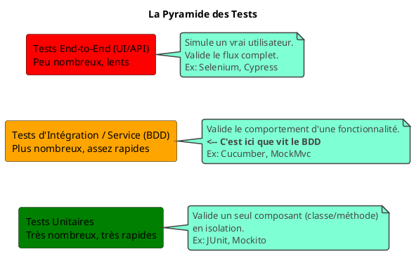

# Chapitre 6 : Projet de Synthèse et Bonnes Pratiques - Pour aller plus loin

Félicitations pour avoir mené le projet de synthèse à son terme ! Vous possédez maintenant toutes les compétences
techniques pour mettre en œuvre le BDD sur un projet Spring Boot. Mais la technique seule ne suffit pas. L'excellence
vient de l'application judicieuse de cette technique.

Cette section est le "guide du sage". Elle contient les conseils, les avertissements et les principes qui transformeront
votre pratique du BDD d'une simple exécution de tests à une véritable philosophie de développement qui améliore la
qualité, la communication et la maintenabilité de vos projets.

### Objectifs pédagogiques

À la fin de cette section, vous serez capable de :

* **Identifier et appliquer** les bonnes pratiques fondamentales de l'écriture de scénarios BDD.
* **Reconnaître** les anti-patterns (pièges courants) et savoir comment les éviter.
* **Comprendre** la place du BDD dans l'écosystème global des tests (pyramide des tests).
* **Configurer** votre projet pour générer des rapports de test HTML lisibles.
* **Intégrer** le BDD dans un flux de travail de développement agile plus large.

### Introduction : L'artisan et le maître

Un artisan sait parfaitement utiliser ses outils. Un maître sait pourquoi il utilise un outil plutôt qu'un autre, et
comment son travail s'intègre dans un projet plus vaste. C'est la transition que nous allons opérer maintenant.

Maîtriser les bonnes pratiques du BDD, c'est s'assurer que les bénéfices que nous avons vantés – la communication, la
documentation vivante, la confiance – se réalisent vraiment. Mal appliqué, le BDD peut devenir une charge, une suite de
tests lente et fragile. Bien appliqué, il devient le super-pouvoir de votre équipe.

### 1. Les Bonnes Pratiques du BDD (Les "À FAIRE")

Ces principes doivent devenir vos réflexes.

<tabs>
<tab title="Écrire du point de vue de l'utilisateur">
Un scénario doit décrire ce que l'utilisateur veut accomplir et ce qu'il observe, pas ce que le système fait en interne.

* **À éviter :** `Then la méthode save() du repository est appelée.` (Détail d'implémentation)
* **À faire :** `Then le nouveau livre doit apparaître dans le catalogue.` (Résultat observable)

</tab>
<tab title="Rester déclaratif, pas impératif">
Nous l'avons déjà vu, mais c'est la règle d'or. Décrivez le **"quoi"**, pas le **"comment"**.

* **Impératif :** `When je saisis "Dune" dans le champ "q" et je clique sur le bouton "btn-search"`
* **Déclaratif :** `When je recherche le livre "Dune"`

Cela rend vos tests plus robustes aux changements d'interface et plus lisibles pour le métier.

</tab>
<tab title="Un seul 'When' par scénario">
Un scénario doit tester **une seule chose**. Un seul comportement. Le `When` est l'action, le déclencheur. S'il y a plusieurs `When`, c'est probablement que vous essayez de tester plusieurs comportements à la fois. Séparez-les en plusieurs scénarios.

</tab>
<tab title="Le BDD ne remplace pas les tests unitaires">
Le BDD est parfait pour les tests de comportement, d'intégration et d'acceptance. Mais il n'est pas fait pour tester chaque petite méthode ou classe de manière isolée. C'est le rôle des tests unitaires (avec JUnit/Mockito), qui sont beaucoup plus rapides à écrire et à exécuter.



Une bonne stratégie de test a une large base de tests unitaires, une couche intermédiaire de tests BDD/intégration, et
un petit sommet de tests end-to-end.

</tab>
</tabs>

### 2. Les Pièges à Éviter (Les "À NE PAS FAIRE")

<warning>
**Attention aux anti-patterns !**
<ul>
<li><b>Scénarios trop longs :</b> Si un scénario a 15 étapes, il est illisible et teste probablement trop de choses. Découpez-le !</li>
<li><b>Dépendance entre scénarios :</b> <strong>Chaque scénario doit être indépendant.</strong> Le scénario 2 ne doit jamais dépendre du fait que le scénario 1 a été exécuté avant lui. Le <code>Background</code> est là pour garantir un état initial commun et propre à chaque exécution.</li>
<li><b>Tester des détails d'implémentation :</b> C'est le piège le plus courant. Ne testez jamais la structure d'une base de données, le nom d'une variable privée ou une librairie interne. Testez le contrat, le comportement observable de l'extérieur.</li>
<li><b>Utiliser l'interface utilisateur comme un oracle :</b> Ne décrivez pas les couleurs, les polices ou la position des éléments dans vos steps Gherkin. Ces détails changent tout le temps et rendront vos tests extrêmement fragiles.</li>
</ul>
</warning>

### 3. La Documentation Vivante : Générer des Rapports

L'un des plus grands bénéfices du BDD est de produire une documentation que tout le monde peut lire. Pour cela, Cucumber
peut générer de magnifiques rapports HTML.

Il suffit de configurer le lanceur de tests pour lui indiquer où générer le rapport.

<procedure title="Configurer les rapports HTML">
<p>La manière la plus simple est de créer un fichier de configuration <code>junit-platform.properties</code> à la racine de <code>src/test/resources</code>.</p>

**`src/test/resources/junit-platform.properties`**

```properties
# Active le plugin de rapportage de Cucumber
cucumber.plugin=pretty, html:target/cucumber-report.html
# Spécifie où se trouvent les features et le code glue
cucumber.glue=fr.formation.spring.librarymanagement.bdd
cucumber.features=src/test/resources/features
```

1. **`pretty`** : Affiche une sortie sympa dans la console.
2. **`html:target/cucumber-report.html`** : C'est la ligne magique. Elle dit à Cucumber de créer un rapport HTML à
   l'emplacement `target/cucumber-report.html` après chaque exécution.

Maintenant, après avoir lancé vos tests (par exemple avec `mvn test` en ligne de commande), ouvrez ce fichier HTML dans
votre navigateur. Vous verrez un rapport détaillé, interactif, montrant chaque feature, chaque scénario, chaque étape,
avec leur statut (passé, échoué) et la durée d'exécution. C'est ce rapport que vous pouvez partager avec votre Product
Owner ou votre chef de projet !

</procedure>

---

### Exercice 8 : Réflexion sur les bonnes pratiques

Ceci est un exercice de réflexion, pas de code. Lisez les deux scénarios ci-dessous et répondez aux questions.

**Scénario A**

```gherkin
Scenario: L'utilisateur se connecte
  Given l'utilisateur est sur la page "/login"
  When il entre "testuser" dans le champ "username"
  And il entre "password123" dans le champ "password"
  And il clique sur le bouton "loginButton"
  Then l'URL doit devenir "/home"
  And la table "USER_SESSIONS" doit contenir une nouvelle ligne
```

**Scénario B**

```gherkin
Scenario: Un utilisateur valide peut se connecter au système
  Given un utilisateur est enregistré avec le nom "testuser"
  When il se connecte avec ses identifiants valides
  Then il doit être redirigé vers sa page d'accueil
  And sa session doit être active
```

**Questions :**

1. Lequel de ces deux scénarios est écrit dans un style déclaratif ? Pourquoi ?
2. Lequel est le plus fragile face à des changements techniques (ex: un refactoring du front-end ou de la base de
   données) ? Expliquez.
3. Si vous étiez un Product Owner ne sachant pas coder, lequel comprendriez-vous le mieux ?
4. Identifiez au moins deux "anti-patterns" dans le Scénario A.

### Correction exercice 8 {collapsible='true'}

1. **Scénario B est déclaratif.** Il décrit l'intention ("se connecte avec ses identifiants valides") sans préciser
   comment cela se fait (quels champs, quels boutons).
2. **Scénario A est beaucoup plus fragile.** Si un développeur renomme le champ `username` en `email`, ou le bouton
   `loginButton` en `submitBtn`, le test échoue alors que la fonctionnalité de connexion marche toujours. De même, si le
   nom de la table `USER_SESSIONS` change, le test est cassé. Le Scénario B est immunisé contre ces changements.
3. **Le Scénario B est infiniment plus clair** pour un non-technicien. Il parle le langage du métier et du comportement,
   pas le langage de la technique.
4. **Anti-patterns dans le Scénario A :**
    * **Style impératif :** Il décrit les clics et la saisie de champs.
    * **Test de détails d'implémentation :** Il vérifie directement une table en base de données (`USER_SESSIONS`), ce
      qui est un très grand "non". Il devrait vérifier un comportement observable ("sa session doit être active", ce qui
      pourrait être testé en essayant d'accéder à une page protégée, par exemple).

---

### Auto-évaluation Finale

1. **La "pyramide des tests" suggère que vous devriez avoir :**
   a) Autant de tests unitaires que de tests BDD.
   b) Plus de tests End-to-End que de tests unitaires.
   c) Une large base de tests unitaires rapides, et moins de tests d'intégration/BDD plus lents.
   d) Uniquement des tests BDD.

2. **Lequel de ces "steps" est un bon exemple de pratique BDD ?**
   a) `Then je vérifie que le cache de second niveau de Hibernate est vide.`
   b) `Then le produit est ajouté à mon panier.`
   c) `When j'appelle la méthode `POST` sur `/api/cart`.`
   d) `Then la ligne suivante est insérée dans la table 'CART_ITEMS'.`

3. **Quel est le principal risque si vos scénarios de test ne sont pas indépendants les uns des autres ?**
   a) Les tests seront plus lents à s'exécuter.
   b) Le rapport HTML ne pourra pas être généré.
   c) Un échec dans un scénario peut provoquer des échecs en cascade dans les suivants, rendant le débogage très
   difficile.
   d) Il n'y a aucun risque, c'est une bonne pratique pour optimiser les tests.

4. **En vos propres mots, expliquez le concept de "Documentation Vivante". Pourquoi est-ce si différent d'une
   documentation classique (ex: un document Word ou un Wiki) ?**

5. **Vous venez de rejoindre un projet où les scénarios Gherkin sont remplis de sélecteurs CSS et d'ID de boutons. Quel
   est le problème principal avec cette approche, et quel argument utiliseriez-vous pour convaincre l'équipe de passer à
   un style plus déclaratif ?**


